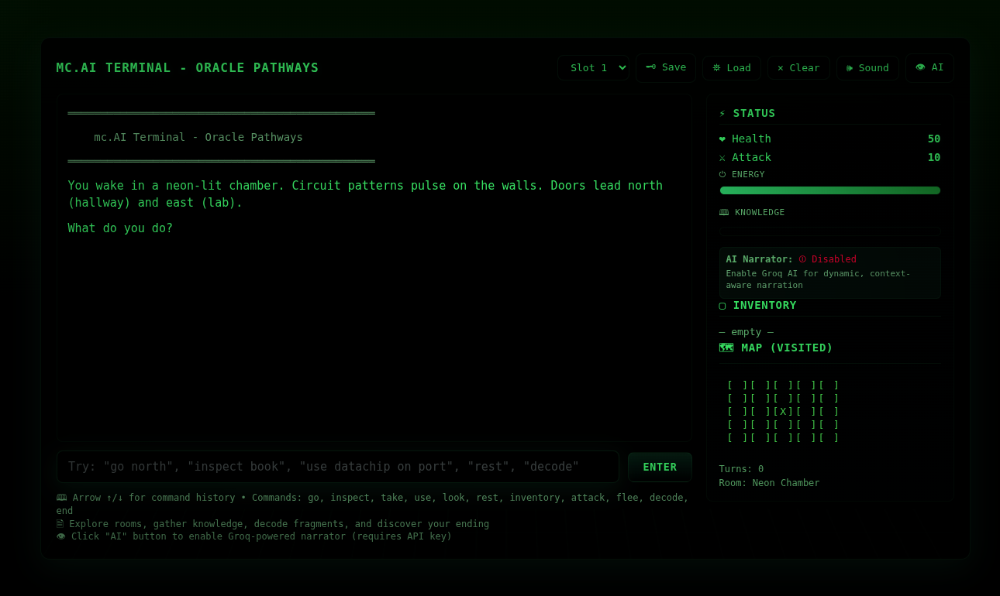

# mc.AI Terminal - Oracle Pathways

A cyberpunk text adventure game built with vanilla JavaScript, featuring an AI-powered narrator and centralized text management system.




## Overview

Oracle Pathways is an interactive text adventure that takes place in a digital realm.
> This is an ongoing project. Look at this as a proof of concept at this stage.

## Technical Architecture

### File Structure

```
/
├── index.html          # Main HTML structure
├── styles.css          # Terminal-style CSS
├── favicon.png         # Game icon
└── js/
    ├── main.js         # Application entry point and UI initialization
    ├── game.js         # Core game logic and state management
    ├── commands.js     # Command parsing and execution
    ├── rooms.js        # Room definitions and descriptions
    ├── narrator.js     # Local and AI-powered narration system
    ├── ui.js           # User interface management
    ├── storage.js      # Save/load functionality
    ├── utils.js        # Utility functions
    └── texts.js        # Centralized text management system
```

### Key Components

**Text Management System**
- All hardcoded strings centralized in `texts.js`
- Dynamic text population via JavaScript
- Template support for variable substitution
- Easy localization and maintenance

**Game State Management** (Ongoing) 
- Player statistics (health, attack, energy, knowledge)
- Inventory system
- Room exploration and mapping
- Game flags and progression tracking

**Command System**
- Natural language command parsing
- Context-aware responses
- Item interaction and usage
- Knowledge-based progression

## Installation

1. Clone or download the project files
2. Serve the files using a local web server (required for ES6 modules)
3. Open the application in a browser

### Local Development Server

```bash
# Using Python 3
python -m http.server 8000

# Using Node.js (if you have http-server installed)
npx http-server

# Using PHP
php -S localhost:8000
```

## Usage

### Basic Commands

- `go [direction]` - Move north, south, east, or west
- `look` - Examine current room
- `take [item]` - Pick up items
- `inspect [target]` - Examine items or room features
- `use [item]` - Use items (with optional target)
- `inventory` - View carried items and stats
- `rest` - Recover health and energy
- `decode` - Decode knowledge fragments (requires 30+ knowledge)
- `end` - Trigger game ending
- `help` - Display available commands

### AI Narrator Setup

1. Click the "AI" button in the interface
2. Enter your Groq API key when prompted
3. Get a free API key at [console.groq.com](https://console.groq.com)
4. The AI narrator will provide dynamic commentary on your actions

### Save System

- Use the save slot dropdown to select a slot (1-3)
- Click "Save" to store your current progress
- Click "Load" to restore a saved game
- Game state is stored in browser localStorage

## Game Mechanics

### Knowledge System (Ongoing)

Knowledge is gained through: 
- Inspecting rooms and items
- Taking specific items (datachip, book)
- Using items in specific locations
- Decoding fragments

### Endings (Ongoing)

The game features four different endings based on knowledge level:
- **Ascension** (80+ knowledge): Become one with the Oracle
- **Liberation** (50+ knowledge): Break free with understanding
- **Partial Knowledge** (25+ knowledge): Leave with fragments of truth
- **Forgotten** (<25 knowledge): Fade into background noise

### Energy System (Ongoing)

- Each action costs 2 energy points
- Resting recovers 40 energy and 10 health
- Energy affects gameplay progression

## Development

### Adding New Content

**New Rooms**
1. Add room definition to `rooms.js`
2. Update room connections and exits
3. Add room-specific text to `texts.js` if needed

**New Commands**
1. Add command parsing logic to `commands.js`
2. Implement command functionality
3. Add command help text to `texts.js`

**New Text Content**
1. Add text constants to `texts.js`
2. Use `formatText()` for dynamic content
3. Use `getRandomText()` for varied responses

### Code Style

- ES6 modules with import/export
- Consistent error handling with null checks
- Centralized text management
- Functional programming approach
- Clear separation of concerns

## Browser Compatibility

- Modern browsers with ES6 module support
- Chrome 61+, Firefox 60+, Safari 10.1+, Edge 16+
- Local server required for development

## License

This project is open source. Feel free to modify and distribute according to your needs.

## Contributing

1. Fork the repository
2. Create a feature branch
3. Make your changes
4. Test thoroughly
5. Submit a pull request

## Support

For issues or questions:
1. Check the browser console for error messages
2. Ensure you're serving files from a local server
3. Check that all JavaScript modules are loading correctly
